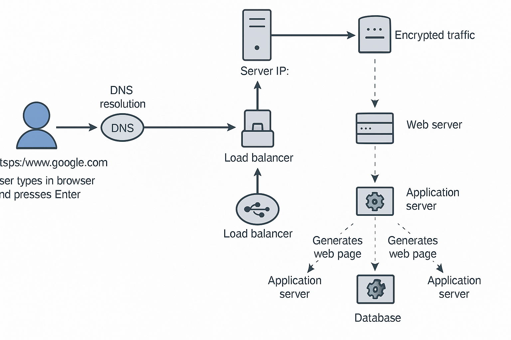

# What happens when you type `https://www.google.com` and press Enter?

This document explains the flow of a web request when a user enters `https://www.google.com` in their browser and presses Enter.

## 1. DNS Resolution

When the user types the URL, the browser checks the DNS to resolve `www.google.com` to its corresponding IP address. This involves:

* Checking the browser cache
* Checking the OS cache
* Querying the local DNS resolver
* Possibly reaching out to a root DNS server, TLD server, and authoritative name server

## 2. TCP/IP and Port

Once the IP address is resolved, the browser initiates a TCP connection to the server using port 443 (default for HTTPS). TCP ensures reliable transmission of data.

## 3. Firewall

The request passes through local and network firewalls. Firewalls filter traffic and only allow legitimate connections based on defined rules.

## 4. HTTPS/SSL

HTTPS ensures the communication is encrypted using SSL/TLS protocols. The client and server perform a TLS handshake to securely exchange encryption keys.

## 5. Load Balancer

The request arrives at a load balancer that distributes traffic across multiple servers to improve performance and availability. Common algorithms include:

* Round Robin
* Least Connections
* IP Hashing

## 6. Web Server

The load balancer forwards the request to a web server (like Nginx or Apache). The web server handles static content and forwards dynamic requests to the application server.

## 7. Application Server

The application server (like a Python Flask app, Node.js, etc.) processes the logic of the request. It interacts with backend services and prepares the response.

## 8. Database

If necessary, the application server queries a database (like MySQL or PostgreSQL) to fetch or store data needed for the response.

## 9. Response Path

The application server sends the response to the web server, which returns it to the load balancer, and finally the browser receives it. The browser then renders the page to the user.

---